# Proceso de Instalación

Uno de los servicios que ofrecemos es una página web con catálogo de las películas que ofrecemos.

*Hemos utilizado una plantilla gratiuta para nuestra página*

1. Primero nos hemos connectado a través de ssh en nuestra máquina local al servidor de aws para poder operar de manera más comoda, utilizando la clave privada de nuestro servidor.

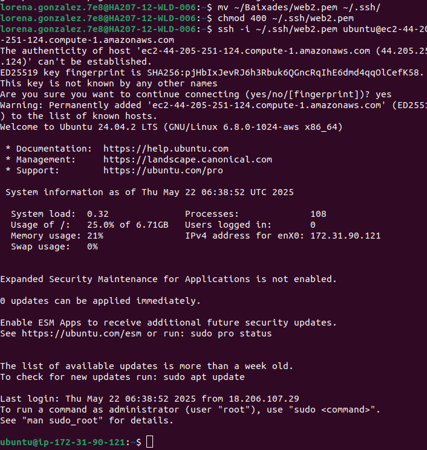

2. Nos instalamos git para poder descargarnos la plantilla:

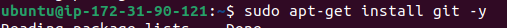

3. Obtenemos el fichero:

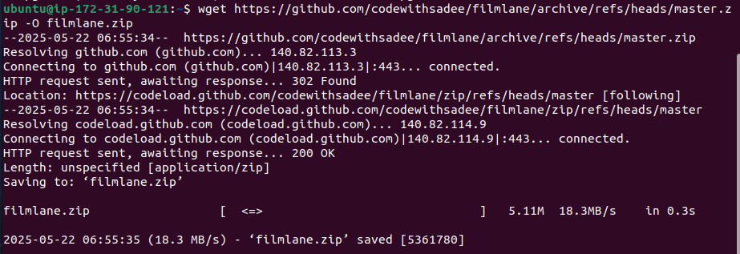

- Comprovamos:

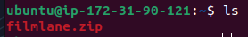

4. Descomprimimos el zip

- Instalamos el unzip:

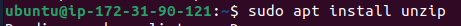

- Descomprimimos el zip:

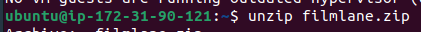

- Comprovamos:

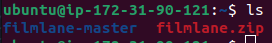

5. Instalamos Nginx

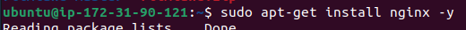

- Comrpovamos:

6. Movemos la carpeta para poder hacerla disponible en la web

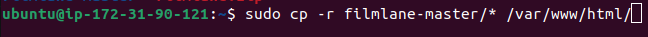

7. Nos conectamos a traves del navegador y comporvamos que podemos acceder a la página web: http://44.205.251.124/index.html

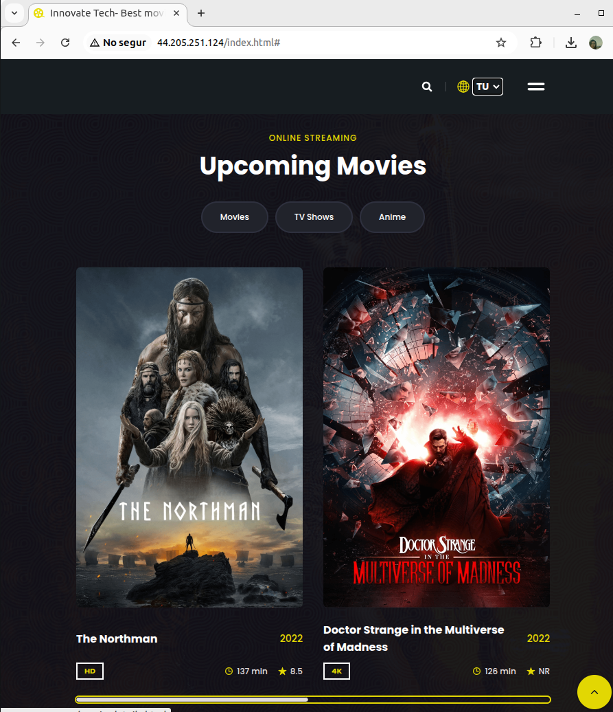

Como vamos a instalar en nuestro servidor otro servicio web creamos una carpeta dentro de html para cada uno de los servicios, en este caso uno llamado web y movemos el contenido:

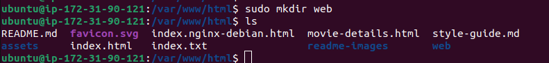

