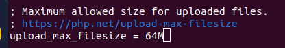
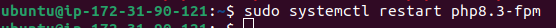

# CMS WordPress
En este documento se describe el proceso de instalación de WordPress en un servidor Ubuntu alojado en AWS EC2, junto a la configuración necesaria de PHP, MySQL y Nginx para su correcto funcionamiento.

## Instalación

Creamos un directorio dedicado a WordPress dentro del directorio público de Nginx para separar los diferentes servicios:
 ```bash
sudo mkdir /var/www/html/cms
```
> [!NOTE] 
>Esto permite organizar mejor los proyectos alojados en el mismo servidor.


Instalamos PHP y los módulos requeridos por WordPress:


| Paquete       | Descripción                                      |
|--------------|--------------------------------------------------|
| php-fpm      | Manejador de PHP para Nginx (FastCGI).          |
| php-mysql    | Conecta PHP con bases de datos MySQL.           |
| php-gd       | Manipulación de imágenes.                       |
| php-xml      | Lectura de archivos XML, plugins.               |
| php-mbstring | Soporte para caracteres multibyte.              |
| php-curl     | Conexiones externas (API, actualizaciones).     |


Editamos el archivo de configuración para ajustar valores necesarios:
 ```bash

sudo nano /etc/php/8.1/fpm/php.ini
```





Reiniciamos:



Instalamos la base de datos:

```bash
sudo apt install mysql-server -y
sudo mysql_secure_installation
```


Entramos a MySQL como root:
```bash
sudo mysql -u root -p
```


Creamos nuestra base de datos:

```bash
CREATE DATABASE cms_db;
CREATE USER 'cms_user'@'localhost' IDENTIFIED BY 'pirineus';
GRANT ALL PRIVILEGES ON cms_db.* TO 'cms_user'@'localhost';
FLUSH PRIVILEGES;
EXIT;
```


Descargamos y extraemos WordPress:

```bash
wget https://wordpress.org/latest.tar.gz
```


```bash
tar -xvzf latest.tar.gz
```


Lo movemos a la carpeta que hemos creado anteriormente:


> [!WARNING]
> Esto da problemas más adelante.


Cambios de permisosAsignamos permisos adecuados para Nginx y WordPress:

```bash
sudo chown -R www-data:www-data /var/www/html/cms
sudo chmod -R 755 /var/www/html/cms
```


Creamos un archivo de configuración para el sitio:
```bash
sudo nano /etc/nginx/sites-available/cms
```


Activamos y recargamos:


Entramos en la web a través del navegador: 
```bash
http://34.225.113.88/cms
```


Configuramos:


### Problema 


El contenido de WordPress se encontraba dentro de una subcarpeta wordpress, lo que impedía su correcto funcionamiento desde /cms.

>[!NOTE] 
>WordPress se descomprime dentro de una carpeta wordpress, que debemos vaciar en el directorio final para que funcione correctamente.

**SOLUCIÓN**:
Movemos todo el contenido de la carpeta wordpress el contenidop a cms y eliminamos la carpeta:


>[!IMPORTANT]
>WordPress necesita que sus archivos estén directamente en el directorio raíz del servicio, no dentro de una carpeta intermedia para que la instalación y carga del sitio funcionen correctamente.


