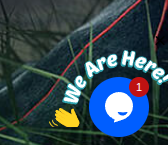
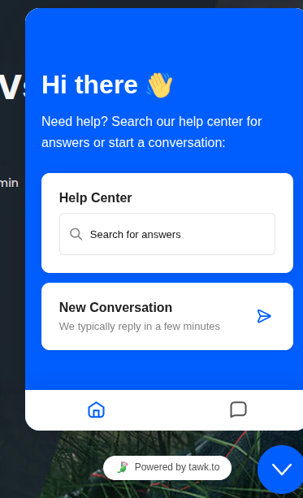

## CHT

Hemos realizado la integración del widget de Tawk.to dentro de nuestro sitio web, lo cual implicó:

- Crear una cuenta en Tawk.to.
- Configurar un canal de chat con funcionalidades de inteligencia artificial.
- Generar y adaptar el script de inserción para incluirlo en nuestras páginas web.
- Realizar pruebas de funcionamiento y ajustes de comportamiento para garantizar una experiencia fluida.
- Personalizar el aspecto visual del chat para que se alinee con nuestra identidad de marca.

### Funcionamiento del sistema

El chat AI de Tawk.to permite a los usuarios iniciar conversaciones en cualquier momento desde cualquier sección del sitio. La inteligencia artificial integrada responde automáticamente a preguntas frecuentes, proporciona asistencia básica y, si es necesario, redirige las consultas a un agente humano. Todo esto se gestiona desde un panel centralizado que facilita el monitoreo, el análisis de métricas y la atención simultánea de múltiples conversaciones.

Entre sus características destacan:
- Respuestas automatizadas basadas en una base de conocimientos.
- Transferencia fluida a agentes humanos.
- Personalización de mensajes de bienvenida y comportamiento según horarios.
- Acceso a historial de conversaciones y estadísticas en tiempo real.

### Planes futuros

Estamos trabajando en varias líneas de mejora para esta herramienta:

- **Entrenamiento personalizado del chatbot AI**, basado en nuestras preguntas frecuentes, documentación técnica y casos de uso reales.
- **Integración con nuestro CRM** para que los datos capturados en el chat se sincronicen automáticamente con los perfiles de nuestros clientes.
- **Automatización de flujos de soporte**, permitiendo escalar la atención sin perder calidad.
- **Implementación multilingüe**, comenzando con inglés y portugués, para ampliar nuestra cobertura internacional.

Con estos pasos, buscamos no solo mejorar la eficiencia operativa, sino también elevar la calidad de la experiencia del usuario en todos los puntos de contacto con nuestra marca.

---