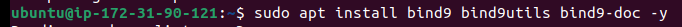
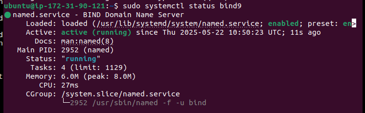
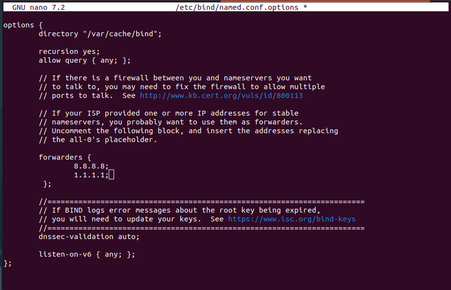
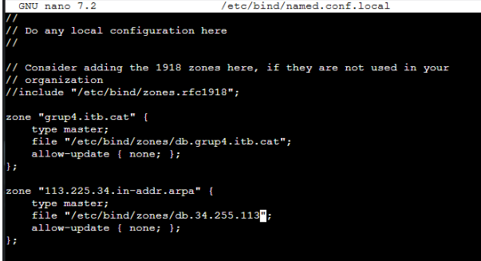
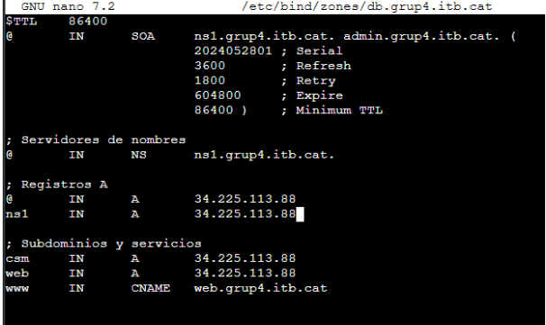
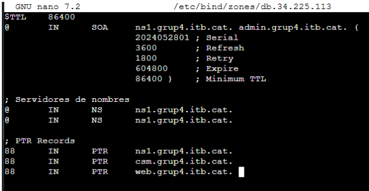
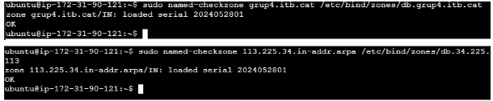
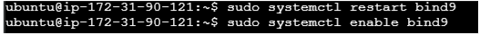

# Instalación y Configuración de DNS
Este documento describe los pasos necesarios para instalar y configurar BIND9 como servidor DNS, incluyendo la validación de archivos de zona y la resolución externa.

---

## Instalación de BIND9

Instalamos el paquete BIND9 desde los repositorios oficiales:

```bash
sudo apt update
sudo apt install bind9 bind9utils bind9-doc -y
```






Configuración para Resolución Externa:

```bash
sudo nano /etc/bind/named.conf.options
```



- Configuramos el archivo de zonas

```bash
sudo nano /etc/bind/named.conf.local
```


- Configuramos las diversas zonas: 
    - Directa:
```bash
sudo nano /etc/bind/zones/db.grup4.itb.cat
```


    - Inversa:
```bash
sudo nano /etc/bind/zones/db.34.225.113
```



Verificamos que el archivo principal de configuración de BIND **(/etc/bind/named.conf)** no contiene errores.

```bash
sudo named-checkconf
sudo named-checkzone tudominio.com /etc/bind/zones/db.tudominio.com
sudo named-checkzone 113.225.34.in-addr.arpa /etc/bind/zones/db.34.225.113
```


Reiniciamos:

```bash
sudo systemctl restart bind9
sudo systemctl enable bind9

```

