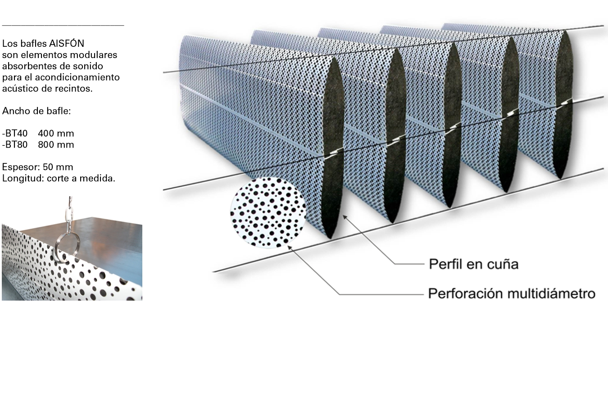

## ¿Que és?
Los bafles acústicos son paneles suspendidos verticalmente desde el techo, fabricados con materiales altamente absorbentes (como lana mineral o PET reciclado). Su función principal es captar y disipar las ondas sonoras producidas por servidores, sistemas de refrigeración y ventilación, reduciendo así la reverberación y el eco dentro de la sala. Al estar distribuidos estratégicamente, los bafles absorben el ruido en ambas caras, logrando un ambiente acústicamente controlado incluso en espacios con techos altos y superficies duras

## ¿Por qué utilizarlo?

- Permiten cumplir con la normativa de salud laboral, evitando la exposición prolongada a altos niveles de ruido que pueden afectar la salud de los trabajadores.

- Mejoran el confort acústico y reducen el estrés, facilitando la comunicación y la concentración en tareas técnicas.

- Su instalación es rápida y sencilla, sin necesidad de obras ni interrupciones significativas en la operativa del CPD.

- No obstaculizan el acceso a los equipos ni a la luz natural, y se adaptan a cualquier diseño arquitectónico.

- Son una solución flexible y escalable, ideal para salas que requieren mantenimiento frecuente y alta densidad de equipos

## Precios

La media ronda los 175–180 €/m² al nosotros tener 21m² nos ha costado cerca de 4.000 €.