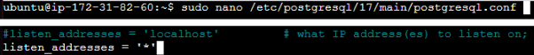
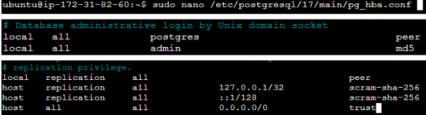
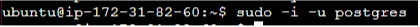
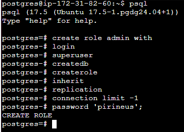
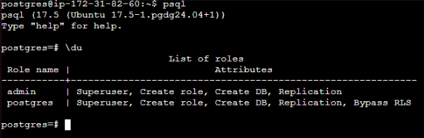
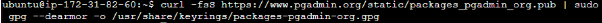
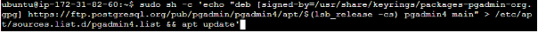
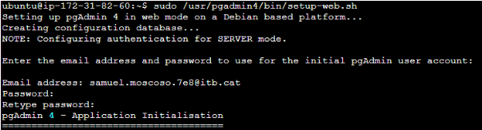
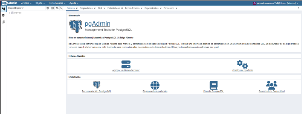

# Proceso de instalación

1. Instalamos PostgreSQL:
```bash
sudo apt install -y postgresql
```


2. Configuramos el PostgreSQL para unirse mediante pgadmin4 via web:
```bash
sudo nano /etc/postgresql/17/main/postgresql.conf
```


```bash
sudo nano /etc/postgresql/17/main/pg_hba.conf
```


Reiniciamos
```bash
sudo systemctl restart postgresql
```


3. Creamos el Rol de administrador en PosgreSQL
Para poder crear roles primero entramos dentro de la base de datos como usuario
```bash
sudo -i -u postgres
```


Creamos el rol y sus características:



Estos són los usuarios que se encuentran en nuestra base de datos y sus roles:
```bash
psql
```



4. Instalamos pgadmin4
```bash
curl -fsS https://www.pgadmin.org/static/packages_pgadmin_org.pub | sudo gpg --dearmor -o /usr/share/keyrings/packages-pgadmin-org.gpg
```


```bash
sudo sh -c 'echo "deb [signed-by=/usr/share/keyrings/packages-pgadmin-org.gpg] https://ftp.postgresql.org/pub/pgadmin/pgadmin4/apt/$(lsb_release -cs) pgadmin4 main" > /etc/apt/sources.list.d/pgadmin4.list && apt update'
```


```bash
sudo apt install pgadmin4
```


6. Configuramos para el webserver:
```bash
sudo /usr/pgadmin4/bin/setup-web.sh
```





7. Nos metermos al pgAdmin4 mediante la ip publica de la instacia:

![Install] (./imagenes/Base/Ip.png)

![Install] (./imagenes/Base/PI.png)

8. Añadiremos un servidor dandole a: 

![Install] (./imagenes/Base/server.png)

![Install] (./imagenes/Base/nombre.png)

![Install] (./imagenes/Base/local.png)

9. Una vez ya dentro crearemos las tablas, crearemos los usuarios y definiremos los roles que tendran:
```bash
Creacion de usuarios
```
![Install] (./imagenes/Base/base.png)