# INSTALACIONES
EL poligono donde nos encontramos ya cuenta con uns medidas de seguridad propias relativas a la restricción del acceso a recinto y el control de este: 

- **Barreras y control de acceso** → El recinto esta asegurado con ballas que rodean todo el perimietro, sumando al control de caceso en la entrada por una targeta identificativa 

- **Videovigilancia Y Monitorización** → Disponen de un servicio de videovigilancia 24/7 que controlan la presencia de actividades sospechosas. También cuentan con sistemas internos para controlar y monitorizar la gestión de los sistemas en caso de fallas en la seguridad.

Sin embargo, ninguna medida de seguridad es poca por lo que hemos establecido medidas propias de la empresa para garantizar la máxima seguridad y reducir cualquier daño posible:

# ACCESO AL CPD
En nuestro CPD, el acceso a la sala principal está protegido mediante un sistema de seguridad multicapa que combina tecnología, procedimientos estrictos y una política de acceso basada en la mínima necesidad.

## Capas y Procedimiento de Acceso
### Identificación previa y autorización

Todo el personal que requiera acceso debe estar previamente registrado en el sistema de seguridad y contar con la formación específica en riesgos y protocolos del CPD.

La autorización se revisa periódicamente y se retira inmediatamente en caso de cambio de funciones o finalización de la relación laboral.

### Tarjeta identificativa RFID

El primer punto de acceso físico a la sala se realiza mediante una tarjeta identificativa RFID personalizada. Hemos instalado lectores ***HID iCLASS SE R40***, compatibles con tarjetas inteligentes y llaveros, que permiten un control preciso y rápido.

Cada uso de la tarjeta queda registrado en el sistema de gestión de accesos, indicando usuario, hora y puerta utilizada.

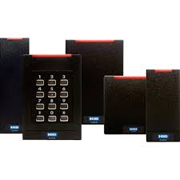

### Control biométrico

En zonas de máxima sensibilidad, como la entrada principal de la sala de servidores, hemos incorporado lectores biométricos ***Suprema BioEntry W2*** (huella dactilar) y, en puntos críticos, terminales de reconocimiento facial ***Hikvision DS-K1T671MF***.

El acceso solo es posible si se validan ambos factores: tarjeta y biometría, garantizando así que solo el personal autorizado y presente físicamente pueda entrar.

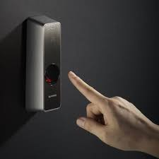

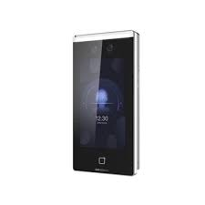

### Puerta de seguridad y esclusa

La entrada a la sala CPD está equipada con una puerta de seguridad de doble hoja, con cerradura electromagnética y sensor de apertura, que solo se desbloquea tras la validación exitosa de ambos sistemas.

En horarios de baja actividad, se activa un modo esclusa: solo puede entrar una persona a la vez, evitando el “tailgating” (entrada no autorizada tras otra persona).

### Registro y monitorización en tiempo real

Todos los accesos quedan registrados en la plataforma de gestión centralizada (Genetec Security Center), que permite la monitorización en tiempo real y la generación de alertas automáticas ante cualquier intento de acceso no autorizado o anomalía.

El sistema está integrado con la videovigilancia: cada acceso activa la grabación de las cámaras cercanas, asociando vídeo y registro de acceso para una trazabilidad completa.

### Acceso para visitas y técnicos externos

Las visitas o técnicos de mantenimiento externos solo pueden acceder bajo la supervisión directa de personal propio, tras haber sido registrados y autorizados temporalmente en el sistema.

Se emiten tarjetas de acceso temporales y se limita el acceso solo a las zonas necesarias, quedando todo el proceso documentado.

## Armarios y Racks Cerrados

La protección física de los componentes más críticos dentro del CPD es igual de rigurosa que la de la sala en su conjunto. Por ello, cada armario y rack de servidores, almacenamiento y comunicaciones está equipado con sistemas de cierre electrónico o biométrico independientes.

#### Tipos de Cerraduras y Modelos

**Cerraduras electrónicas con teclado y RFID**:

Hemos instalado cerraduras inteligentes EMKA eCam, que permiten la apertura mediante código PIN, tarjeta RFID o control remoto desde la central de seguridad. Estas cerraduras registran cada apertura y cierre, asociando la acción al usuario autorizado.

**Cerraduras biométricas**:

En los racks que almacenan datos especialmente sensibles (copias de seguridad, datos personales, etc.), utilizamos cerraduras Suprema BioLite N2, que requieren huella dactilar para su apertura.

**Sensores de apertura y alarmas**:

Todos los armarios están equipados con sensores de apertura conectados al sistema de gestión central. Si se detecta una apertura fuera de procedimiento o en horario no autorizado, se activa una alarma y se notifica automáticamente al equipo de seguridad.

# VIDEOVIGILÁNCIA

Nuestro edificio cuenta con diversas camras de videovigilancia para proporcionar la mayor seguridad posible.

Segun la ley española la videovigilancia ha de estar señalizada por lo que tambien podemos en contrar enla entrada del edificio una placa con la que se informa que el edificio cuenta con videovigilancia.

Conectadas las **24 horas del dia los 7 dias** de la semana y monitorizadas constantemente por personal de seguridad tenemos ubicadas 3 camaras de seguridad en nuestro CPD:

- La primera ubicada  en la esquina izquierda superior a la puerta que nos permite visualizar toda la sala.
- La segunda la colocams diagonal a esta primera para tener una control de la entrada/salida.
- Por último una tercera cámara en el medio de 360º donde podemos ver todos los puntos de la ssale simultaneamente.

Hemos optado por el siguiente modelo de camara para las esquinas:

**Hikvision DS-2CD2543G0-IWS**
- Resolución 4 MP	
- Visión nocturna por infrarrojos hasta 10m
- Resistente al agua, polvo y vandalismo, ideal para entornos exigentes como CPD

Precio entre 60-120 € 

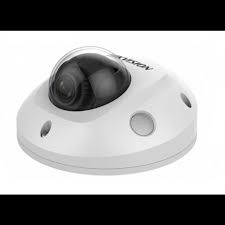

Después para la camara panorámica tenemos: 

**Axis M3058-PLVE (12 MP, 360°, PoE)**
- Visión panorámica de 360º para cubrir toda la sala
- Resolución muy alta (ideal para identificar detalles en todo el espacio)
- Visión nocturna y PoE

Su precio ronda los 1.000 € 

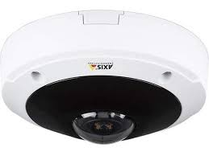

Sumando estas cámaras también tenemos controlada las otras areas del edificio.(11)
Otras salas en el interior: 6 cámaras
Exterios: 9 cámaras para controlar el area perimetral.

Para estas cámares hemos escoguido dos modelos: 

Uno para interiores: 

**TP-Link Tapo C200**
- 1080p HD	
- Cobertura 360° horizontal, visión nocturna, detección movimiento, audio bidireccional, almacenamiento en SD	
- Precio: 24–30	€ 

Y otro modelo para exteriores: 

**Arlo Pro 5**
- 2K
- WiFi, visión nocturna, audio bidireccional, sensor PIR.
- Sirena integrada
- Resistente a condicines climaticas:  IP65, resistente a la intemperie (lluvia, sol, viento, nieve), funciona en rangos de temperatura de -20 °C a 45 °C.
- Precio = 250 € 

# INCENDIOS
Los incendios dentro de los CPD son poco frecuentes, pueden comenzar en salas contiguas, sin embargo, representan una gran amenazada debido al valor de la información almacenada y al impacto negativo que tendria una perdida de la misma. Por lo tanto su protección a de avarcar tanto la prevención, su detección temprana y sistemas de exitinción eficaces.

### Prevención

La gran mayoría de los incendios en CPD pueden evitarse en la fase de prevención.
- Mas del 80 % de los incendis en CPD se pueden evitar con buenas tecnicas de prevención y mantenimiento ya que las mayores causas de estos accidentes se debe a cortocircuitos, sobrecalentamienstos, mal cableado...

Para preveer los incendios seguimos una serie de medidas que ayudan a reducir el riesgo, si bien, no lo elimianan al completo. 

- Mantenimiento regular y gestión del cableado:
Realizar inspecciones periódicas y mantenimiento de todos los sistemas eléctricos y mecánicos permite detectar peligros a tiempo. Una correcta organización y fijación de los cables previene sobrecalentamientos y cortocircuitos, causas principales de incendios en data centers. Esta medida es sostenible, prolonga la vida útil de los equipos y reduce residuos.

- Control de temperatura:
Con los sensores de temperatura llevamos un registr y control de la temperatura, mantenarla baja evita el sobrecalentamiento de los equipos reduciendo asi el riesgo de incendio. 

- Materiales y compartimentación:
Es importante evitar los materiales inflamables dentro del CPD. Construyendo paredes incombustibles, con resistencia al fuego pueden actuar como barrera contra el humo, agua, fuego... También se han utilizado placas de yeso en las pardes, suelos y techos.

- Sistemas de reducción de oxígeno (LOX/Nitrógeno):
Estos sistemas mantienen el nivel de oxígeno por debajo del umbral necesario para la combustión, pero seguro para las personas. Utilizan nitrógeno, que es abundante, no tóxico y no deja residuos, proporcionando protección continua y sostenible.

### Detección

Entre un 10% y un 15% de los incendios pueden ser contenidos en esta etapa si la prevención ha fallado pero la detección es muy temprana

Hay diferentes tipos de detectores que nos informan cuando hay algun peligro o desequilibrio en el funcionamineto normal de nuestros CPD. 

Nuestra empresa tiene establecidos 4 detectores de humos, en la CPD, que mandan la informaciona a un acentral de detección y gestión ubicada en la sal de control.

**1.  Detector de aspiración**

Funcionan mediante una red de tubos que aspira aire de la sala y lo analiza en una cámara láser extremadamente sensible, capaz de identificar partículas de humo mucho antes de que sean visibles o detectables por detectores convencionales

Modelo: FAAST FLEX

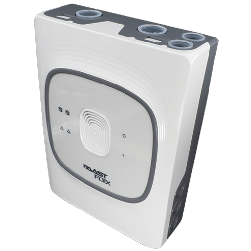

Precio: 1.000 € aprox 

**2. Detectores puntuales de humo ópticos**

Detectan la particulas de humo visibles, adecuado para la fase de desarrollo inicial del incendio.

Modelo : Notifier FSP-85

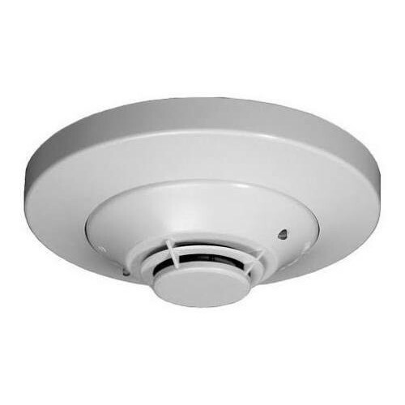

Precio = 60-70 € 
**3. Detectores térmicos**

Son dispositivos diseñados para detectar incendios a través del aumento de temperatura en el ambiente, en lugar de humo. Son especialmente útiles en zonas donde pueden existir partículas en suspensión, polvo o gases que dificultan la detección por humo, y en espacios técnicos como falsos suelos o techos de CPD.

Modelo: Detector Multi-Térmico Analógico NSC FT

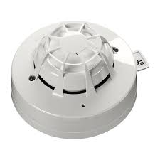

Precio:  35 € y 60 € 

**4. Detectores de llamas (IR/UV)**

Detecta la radiación ultravioleta/infrarroja de las llamas, actuando en la fase de combustión abierta.

Modelo : Spectrex SharpEye 40/40L

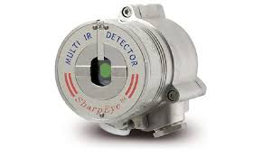

Precio = 5.000 € 

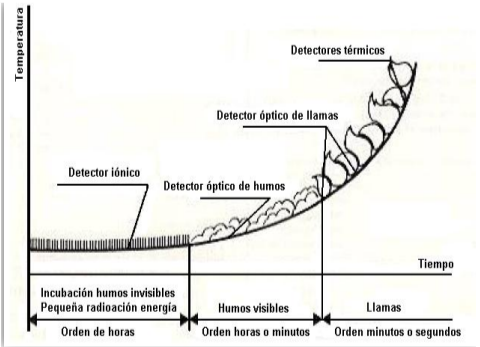

*Los detectores iónicos, al contener material radiactivo (Americio-241) se aconseja no utilizarlos. Un buen sustituto son los detectores de aspiración, más sensibles y sin riesgo.*

A más tenemos instalados otros 2 detectores termicos distribuidos por las salas por si se provoca un indencio en otra area. 

**5. Central de detección y gestión**

La función de una central de detencción y gestió es recibir, procesar y gestionar todas las señales provenientes de los diferentes detectores (humo, aspiración, térmicos, llamas, etc.), así como de pulsadores manuales, y coordinar la activación de alarmas y sistemas de extinción automáticos

#### ¿Para que sirve?
- Recepción y procesamiento de señales: Recoge en tiempo real la información de todos los sensores instalados en el CPD.

- Activación de alarmas: Si se detecta una condición de incendio, activa alarmas acústicas y visuales para alertar al personal.

- Activación automática de extinción: Puede enviar la orden de disparo a los sistemas de extinción (gases limpios, agua nebulizada, etc.) para sofocar el fuego de forma inmediata.

- Supervisión y control: Permite monitorizar el estado de todos los dispositivos conectados y detectar averías o desconexiones.

- Registro de eventos: Guarda un historial de todas las alarmas, activaciones y fallos para análisis posterior y cumplimiento normativo.

- Comunicación con sistemas externos: Puede enviar señales a sistemas de gestión de edificios (BMS), centrales receptoras de alarma o servicios de emergencia.

Nosotros tenemos instalada en nuestra sala de seguridaad una  **Notifier AM-8200**:

- Capacidad: Hasta 4 lazos (bucle) y más de 500 dispositivos por lazo

- Pantalla: LCD gráfica para visualización de eventos y estado del sistema

- Comunicación: Módulos de comunicación TCP/IP, RS-485, integración con BMS

Funciones avanzadas:

- Identificación exacta del detector que ha activado la alarma

- Gestión de zonas y prioridades

- Programación de retardos y escenarios personalizados

- Salidas para control de sistemas de extinción, ventilación y puertas cortafuegos

- Alimentación: Red eléctrica con baterías de respaldo

Precio: Rondando los 2.000€ 

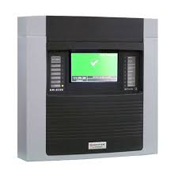

### Extinción

La extinción automática de incendios es la última línea de defensa en la protección de un centro de datos. Si el fuego alcanza este punto, significa que han fallado las etapas previas de prevención y detección temprana, lo que puede poner en riesgo la continuidad del negocio y la integridad de los datos. Por eso, la prioridad debe ser siempre la prevención (mantenimiento, orden y materiales adecuados) y la detección ultra temprana (sistemas de aspiración, detectores ópticos y térmicos). Sin embargo, contar con un sistema de extinción eficiente es imprescindible para minimizar daños si se produce un incendio real.

Nuestro sistema de extinción: [**Novec 1230 (FK-5-1-12)**](./fire.md)

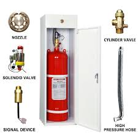

### Vias de avacuación

Como en todo recintos Españoles es obligatorio por ley (Ley 31/1995 de Prevención de Riesgos Laborales) la presencia de como mínimo de dos salidas de emergencia en cada planta, sin embargo, al ser un edificio con menos de 100 trabajadores solamente es necesario tener una salida de emergencia bien señalizada, deben ser accesibles para todos los empleados, independientemete de su ubicación o de su condición física en caso de minusbalia, y no pueden estra bloqueadas ni obstaculizadas. 

En complementación a las vias de evacuación hemos establecido un plan de evacuación donde se han asignado los reoles a los trabajadores, en caso de emergencia disponer de responsables que se encargen de guiar a la gente y asegurarse de que todas las areas estan vacias y se ha realizado con exito la evacuación.

La comunicación es otro factor clave, si un incendio empeza en una zona apartada, la informacion debe de poder transmitirse de maner aeficaz por el resto del edificio, nosotros hemos instalado alarmas, 3 en planta, al saltar una alarma se activan las demás. 

A parte de la alarma creemos que un un sistema de megafonia también ayuda a  la organización.

# RIESGOS NATURALES  

Aunque la seguridad frente a incendios y accesos no autorizados es prioritaria, en la protección de nuestro CPD también hemos considerado los riesgos derivados de catástrofes naturales, ya que pueden afectar gravemente la continuidad operativa y la integridad de los datos.

### Identificación y gestión de riesgos naturales

Al planificar la ubicación y el diseño de nuestro CPD, se realizó un análisis exhaustivo de los principales riesgos naturales presentes en la zona y se tomaron medidas específicas para contrarrestarlos:

**Inundaciones**:

Se evitó situar el CPD en sótanos o en lugares con riego d inundacióon. Nuestra CPD cuenta con sistemas de drenaje y sellado profesional en todas las entradas de cables y tuberías para evitar la entrada de agua. Además, los racks están elevados del suelo y se han instalado sensores de fugas de agua en puntos críticos.

**Terremotos**:

El edificio y la sala del CPD han sido construidos siguiendo normativas sismorresistentes, con estructuras reforzadas y racks anclados para minimizar el riesgo de caída o desplazamiento en caso de movimiento sísmico. También hemos buscado establecernos en una zona con baja actividad sísmica con daños mínimos o inexistentes..

**Fenómenos meteorológicos extremos (tormentas, vientos fuertes, granizo)**:

La infraestructura cuenta con refuerzos estructurales y ventanas protegidas. Se dispone de doble acometida eléctrica, SAI y generadores para garantizar el suministro eléctrico ante cortes provocados por tormentas.

**Incendios forestales y humo exterior**:

Los sistemas de climatización cuentan con filtros de aire de alta eficiencia para evitar la entrada de humo o partículas dañinas.

**Temperatura y humedad extremas**:

El CPD está equipado con sistemas redundantes de climatización y control ambiental, así como sensores de temperatura y humedad que permiten una monitorización continua y alertan ante cualquier desviación de los parámetros seguros.

# ELEMENTOS VISUALES
