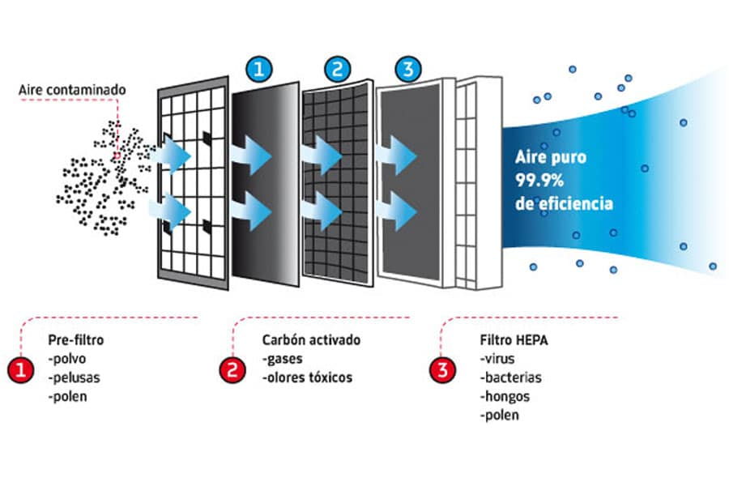

# Filtros HEPA
El primer paso esencial es garantizar que el aire que ingresa al CPD esté libre de contaminantes. Para ello, se emplean filtros HEPA, capaces de retener el **99,97%** de partículas de 0,3 micras o más. Estas partículas pueden incluir polvo fino, polen, bacterias o partículas de combustión, todas potencialmente dañinas para los equipos informáticos sensibles.

> [!CAUTION]
> Si el aire no se filtra correctamente desde el inicio, se rompe toda la cadena de limpieza, ya que las partículas circularían dentro del centro.

Una vez filtrado, el aire debe ser constantemente supervisado mediante contadores de partículas, que miden la concentración de contaminantes microscópicos en tiempo real. Esta monitorización permite detectar cualquier desviación de los valores estándar y activar medidas correctivas de inmediato.

Es importante tener una limpieza constante de suelos, paredes, equipos para evitar la acomulación de particulas como el polvo. Incluso con aire limpio, una superficie contaminada puede liberar partículas al ambiente, comprometiendo la calidad del entorno.