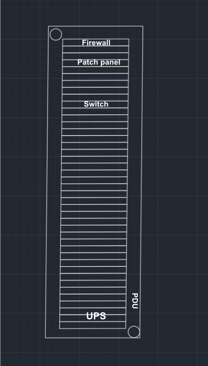
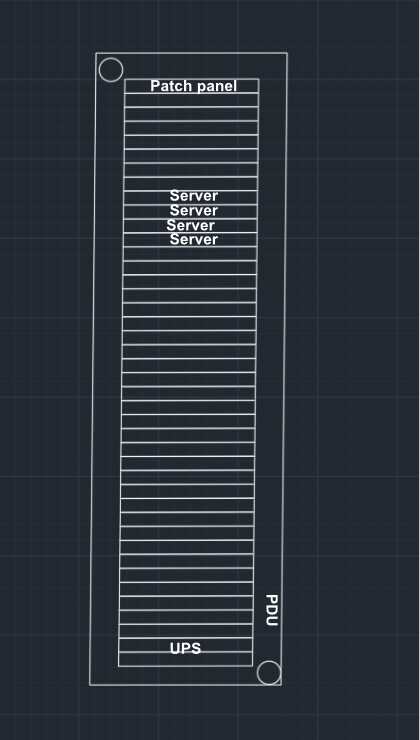
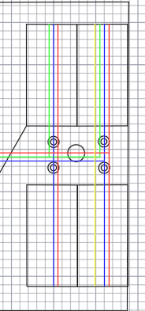

# Servidores
Para nuestra plataforma de streaming VOD (Video bajo demanda) hemos seleccionado el servidor **HP DL380 Gen10 8SFF**. Cada servidor está configurado con:

- CPU: Intel Xeon Silver 4210

- Memoria: 2 x 64 GB DDR4 ECC

- Almacenamiento: 8 x SSD SAS de 1,92 TB

- Red: Mellanox MCX516A-CCAT (tarjeta de red de alto rendimiento)

Consumo energético:

- Operación típica: 150–250 W

- Pico máximo: 250–350 W

Esta configuración permite gestionar hasta 2.000 usuarios concurrentes por servidor en streaming 1080p60 H.265, con un bitrate estándar de 5 Mbps por usuario. Cada rack, con cuatro servidores, soporta 8.000 usuarios concurrentes, y la infraestructura prevista de dos racks puede atender hasta 16.000 usuarios simultáneos.

# Switches 
El núcleo de nuestra red es el **Cisco Nexus 9336C-FX2**, seleccionado por su capacidad, escalabilidad y baja latencia:

- Puertos: 36 x 40/100 Gbps QSFP28, todos con soporte breakout para configuraciones flexibles.

- Capacidad de switching: 7,2 Tbps

- Latencia: <1 μs

- Redundancia: Fuentes de alimentación y ventiladores hot-swap redundantes

- Form factor: 1U, rack-mountable

- Seguridad y gestión: Soporta MACsec, administración avanzada con Cisco NX-OS, virtualización y automatización

- Consumo energético: 367–650 W según configuración

Este switch garantiza un throughput sin bloqueos y permite escalar la red para futuras ampliaciones, manteniendo la baja latencia y la alta disponibilidad requeridas en entornos de streaming intensivo.

# Patch Panels

Para la gestión eficiente y ordenada de las conexiones de fibra óptica entre servidores, switches y firewalls, utilizamos el patch panel **FHU-FPP96FLCH10GMM**:

- Puertos: 48 de fibra óptica (compatibles con los equipos del rack)

- Función: Facilita la organización, identificación y mantenimiento de las conexiones críticas, asegurando flexibilidad y escalabilidad en la infraestructura.

# Distribución en racks: Planos y diagramas
La distribución física en los racks ha sido diseñada para maximizar la eficiencia, la ventilación y la gestión de cableado:

Racks estándar de 42U:

- U 1–4: Patch panels de fibra óptica

- U 5–8: Switch Cisco Nexus 9336C-FX2

- U 9–20: Servidores HP DL380 Gen10 8SFF (hasta 4 por rack)

- U 21–42: Espacio para equipos de expansión, UPS, gestión y cableado estructurado

Cada rack está cableado siguiendo el esquema lógico y físico documentado en los diagramas de red y planta, asegurando accesibilidad, redundancia y facilidad de mantenimiento.

# PLANOS

