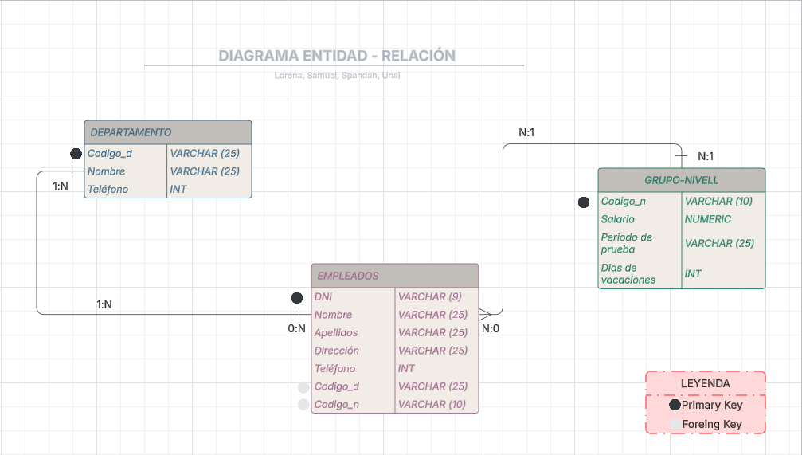

# 1. Lógicas de las Relaciones

## Diagrama de Clases y Relaciones
Hemos utilizado un diagrama de clases UML para representar gráficamente las entidades principales del sistema y sus relaciones. Cada clase representa una entidad, con sus atributos y operaciones. Las relaciones entre clases se muestran mediante líneas, indicando asociaciones, generalizaciones o dependencias

Nuestra base de datos se compone de tres tablas principales: empleados, departamento y categoria, relacionadas de la siguiente forma:

- Un departamento puede tener muchos empleados (relación 1:N). Esto se implementa usando el campo codigo_d en la tabla empleados como clave foránea que referencia a la clave primaria CODI en la tabla departamento.

- Una categoría profesional (grupo-nivell) puede corresponder a muchos empleados (relación 1:N). La relación se refleja en el campo codigo_n de la tabla empleados, que es clave foránea hacia categoria(CODI).

Codigo_d = hacer referncia a la clave identificativa de departamento
Codigo_n = hacer referncia a la clave identificativa de grupo_nivell

