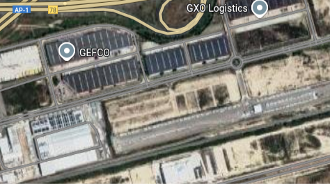
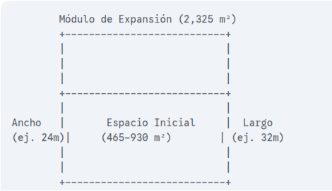

# UBICACIÓN
```
42°42'01.1"N 2°54'42.7"
```
Ubicado en Bilbao, el [**Polígono Arasur**](https://arasur.es/) ofrece todo aquello necesario para poder establecer nuestro CPD:

#### 1. CONEXIÓN
- 📡 **Cruce de fibra de alta velocidad:** Conexiones de ultrabaja latencia hacia Norteamérica y Europa del Norte.
- 🌐 **Cable submarino Grace Hopper:** Refuerza la conectividad internacional entre Bilbao y Nueva York.
- 🧭 Ubicación estratégica ideal para organizaciones que requieren enlaces globales rápidos y fiables.


#### 2. CERTIFICACIONES AMBIENTALES
- 🏅 **Certificación LEED Platinum:** El centro ADI Data Center Euskadi está diseñado bajo los estándares más altos de sostenibilidad.
- 🏗️ Uso de prácticas de construcción ecológicas y fomento de energías renovables.

#### 3. CLIMA
- 🌦️ **Clima templado y húmedo:** Reduce el consumo energético en refrigeración comparado con otras regiones más cálidas de España.

#### 4. SOSTENIBILIDAD
- 🌱 **PUE (Power Usage Effectiveness) de 1.15:** Índice líder en eficiencia energética.
- ☀️ **Adyacente a una planta solar de 135 MW:** Acceso directo a energía limpia y asequible.
- 💧 **Sistema de refrigeración sin agua:** Conserva recursos hídricos y permite refrigeración eficiente hasta 200 kW por rack con refrigeración líquida.

#### 5. SEGURIDAD
- 🔐 **Diseño Tier III:** Alta disponibilidad con estándares de redundancia N+1.
- 📈 **Fiabilidad del 99.9999% (“six nines”)** para cargas críticas.
- 👷‍♂️ Vigilancia continua, sistemas seguros de gestión e infraestructura robusta.

#### 6. INFRAESTRUCTURA
- 🏢 **Campus de última generación:** Tres edificios de data center más uno administrativo, con más de 150,000 m² disponibles.
- 🧱 **Primera fase:** 24,000 m² distribuidos en tres niveles con áreas especializadas para datos, administración y generación de energía.
- ⚙️ **Escalabilidad:** Diseñado para expandirse conforme a la demanda y preparado para cargas de IA de alta densidad.

Dentro del edificio, el CPD se establece en la planta inferior por diversos factores:

- **Mayor estabilidad estructural:** La estructura de la planta baja ofrece una mayor capacidad de carga, lo cual es esencial para soportar el peso de los racks y el equipamiento pesado.
- **Facilidad de acceso:** El movimiento de equipos voluminosos, sistemas de refrigeración y otros materiales pesados es mucho más sencillo al nivel del suelo, evitando el uso de ascensores de carga o maniobras logísticas complejas.
- **Eficiencia en refrigeración y energía:** La proximidad a los sistemas de refrigeración y a la infraestructura eléctrica permite minimizar la longitud del cableado y las tuberías, lo que mejora la eficiencia y reduce costes.
- **Evacuación y acceso de emergencias:** Estar en la planta baja facilita una evacuación más rápida en caso de emergencia y permite un acceso más directo para los servicios de emergencia.

> [!TIP]
> Evita paredes perimetrales para reducir los riesgos asociados a fenómenos meteorológicos, intrusiones o peligros externos.


Ubicación:




Planos:




En estas imagenes podemos observar la distribución de nuestro CDP...

# CLIMATIZACIÓN

Para mantener un funcionamiento correcto de nuestra CPD, la climatización han de estar estrictamente controlada, un desajuste de temperatura podría dañar gravemente el equipo, provocando unas graves perdidas económicas y un impacto ambiental negativo.

Para ello hemos de mantener nuestro CDP con un mínimo de 18ºC, una temperatura más baja incrementa el riesgo de cortocircuitos y corrosiones, y no superar los 27ºC, ya que puede sobrecalentar los servidores y reducir su vida útil. 
Manteniéndonos dentro de ese rango garantizamos una estabilidad térmica y el óptimo rendimiento de los equipos.


| Temperatura (°C) |    
|------------------|        
| 18     |              
| 27     |              

La humedad también es un factor importante a controlar. Una humedad menor a 40% aumenta el riesgo de descargas electroestáticas, sin embargo, una superior a 60%  puede provocar una condensación y corrosión en los circuitos y conexiones. Por tanto, es indispensable mantener este rango para proteger su integridad física y su funcionamiento.

| Humedad Relativa (%) |
|------------------|        
| 40     |              
| 60     | 


### ¿Cómo podemos controlar su temperatura?

Para poder llevar un control de la temperatura adecuada en la sala se han instalado sensores en los racks, en el suelo y techo técnico y cerca de equipos con un uso más grando y exigente. 

La distribución de los sensores a sido la siguiente: 
- 3 sensores x 4 racks = 12 sensores.


    Cada rack tiene 3 sensores :
    - 1 en la parte delantera/inferior (entrada de aire frío)
    - 1 en la parte superior/frontal (entrada de aire frío)
    - 1 en la parte trasera (escape de aire caliente)

- 2 sensores de ambiente.
- 2 sensores para el suelo técnico. 
- 2 sensores en el techo técnico.

En total utilizamos 18 sensores de temperatura, para los rack hemos utilizado sensores [**Platinum Resistance Temperature Detectors (RTDs)**](./rtd.md) ya que se requiere una mayor precisión y una respuesta más rápida. 
Aquellos colocados para controlar la temperatura de la habitación, al no necesitar una precisión tan elevada, los termistores son la mejor opción. 

Estos sensores estan expuestos a una monitorización constante, si un sensor detecta una temperatura fuera del rango se activan los avisos.

Hemos establecido dos tipos de avisos, uno por SMS, email, SNMP , a los responsables en el turno de trabajo. 
Y a más una alarma visual que salta al excederse los limites y alerta a los trabajadores.

Para evitar que la temperatura se desequilibre hemos dispuesto de un sistema hibrido de enfriamiento de la sala a través de procesos sostenibles que intentan evitar el desperdicio de los recursos naturales y la contaminación del medio ambiente.

Este proceso [hibrido aire + agua](./hibrido.md) utiliza centrifugadores para, con el aire caliente, obtener aire frio y circuitos cerrados de agua para evitar su consumo en exceso.


----------------------------------------------------------------


También hay que tener en cuenta la calidad del aire en el entorno, al ser un espacio cerrado y sin ventanas hay que controlar la calidad del aire segÚn el estándar ***SO 14644-1*** el cual define los niveles máximos permitidos de partículas en el aire en entornos controlados. 

La Clase 8 es el mínimo recomendado para CPDs, ya que limita la cantidad de polvo y partículas en suspensión que pueden entrar en contacto con los equipos. 
Mantener el aire limpio evita la acumulación de polvo en los componentes, lo que reduce el riesgo de sobrecalentamiento y fallos mecánicos, y contribuye a la fiabilidad y durabilidad de la instalación.

> [!NOTE]
> El límite es de 3.520.000 partículas de 0,5 micras o más por metro cúbico de aire

Para poder garantizar la pureza del aire instalamos unos [filtros HEPA](./hepa.md).


# IDENTIFICACIÓN

A la hora de desplegar un CPD es fundamental considerar su seguridad dentro del edificio para evitar, en caso de una intrusión, su identificación.

Alguna de las medidas que hemos establecido son:

- **Doble Puerta** → En la sala donde se encuentra el CPD en sustituyendo una puerta tradicional asegurada, instalamos una puerta integrada en la pared, es decir, una puerta oculta que dificulta su detección a personas que no conocen previamente su ubicación.

    Tras pasar esta primera puerta, se accede a la puerta principal de CPD la cual cuenta  con unas medidas de seguridad que se detallarán más adelante.

    

- **Mapas** → Se evita incluir la ubicación del CPD en planos accesibles tanto para empleados como para el público general. 

    Limitando el acceso de los planos y limitando a aquellos que son explícitamente necesarios reducimos las posibilidades de una filtración de seguridad.

- **No señalización** → Una manera sencilla de eludir su reconocimiento es no utilizando señales donde indiquen donde se encuentra.


# CABLEADO
EXPLICAR LA DISTRIBUCIÓN DEL CABLEADO, EL TIPO, COMO LOS HEMOS DITRIBUIDO, DONDE ESTAN LAS TOMAS DE LUZ...

# TECHO Y SUELO
EXPLICAR MEJOR....

En la sala hay una normativa a seguir donde se especifica la necesidad de instalar y asegurar un suelo técnico que permita:

- **Gestionar el cableado** → El espacio bajo el suelo elevado (plénum) permite distribuir y organizar cables de red, fibra óptica y alimentación eléctrica de forma ordenada, segura y accesible. Así se evitan enredos y se facilita el mantenimiento o futuras ampliaciones.

- **Distribución** → El suelo técnico permite canalizar aire frío directamente hacia los racks o equipos, optimizando la refrigeración y reduciendo puntos calientes. Esto es clave para mantener la temperatura adecuada y la eficiencia energética.


- **Soporte estructural** → Está diseñado para soportar el peso de racks de alta densidad, UPS, y otros equipos pesados, garantizando la seguridad y estabilidad del CPD.

- **Mantenimiento** → Los paneles modulares permiten acceder fácilmente a cualquier punto bajo el suelo para inspección, reparación o cambios, sin interrumpir la operación del CPD.


De la misma manera que un suelo, un techo suspendido también ayuda y facilita al funcionamiento del CPD:

- **Mantenimiento** → Al igual que el suelo técnico, el techo modular permite acceder rápidamente a instalaciones superiores para reparaciones o ampliaciones.


Otras características que hemos tenido en cuenta en la estructura de la habitación es él [ruido](./ruido.md) que provocan los CPD, para solucionar este problema se han instalado unos [bafles acústicos absorbentes](./bafles.md) que insonorizan la sala.


Para facilitar la pureza del aire se pintan las paredes de pintura plástica para ayudar en su limpieza.


PLANOS:
-
    

# RACKS

Nuestro CPD cuenta con 4 


