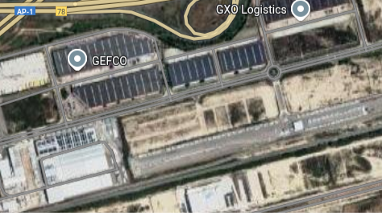
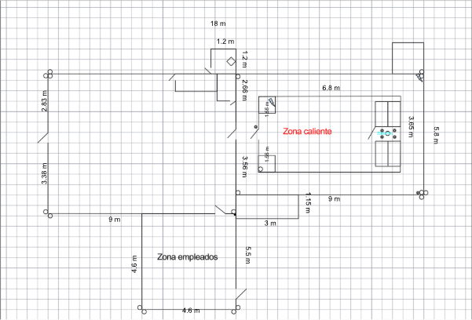
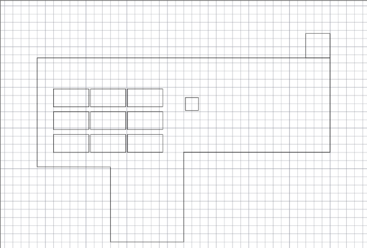
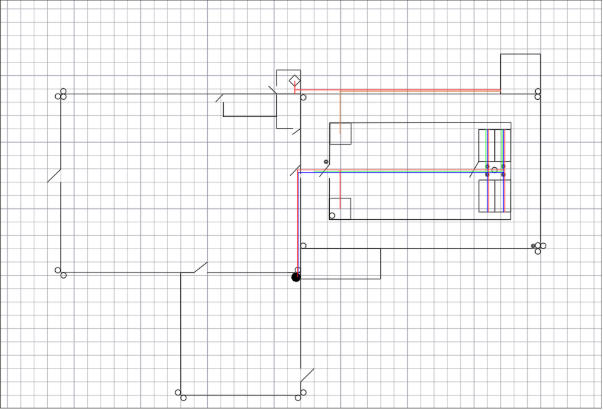
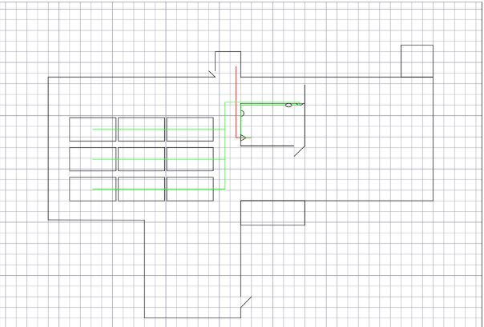

# UBICACIÓN
```
42°42'01.1"N 2°54'42.7"
```
Ubicado en Bilbao, el [**Polígono Arasur**](https://arasur.es/) ofrece todo aquello necesario para poder establecer nuestro CPD:

#### 1. CONEXIÓN
- 📡 **Cruce de fibra de alta velocidad:** Conexiones de ultrabaja latencia hacia Norteamérica y Europa del Norte.
- 🌐 **Cable submarino Grace Hopper:** Refuerza la conectividad internacional entre Bilbao y Nueva York.
- 🧭 Ubicación estratégica ideal para organizaciones que requieren enlaces globales rápidos y fiables.


#### 2. CERTIFICACIONES AMBIENTALES
- 🏅 **Certificación LEED Platinum:** El centro ADI Data Center Euskadi está diseñado bajo los estándares más altos de sostenibilidad.
- 🏗️ Uso de prácticas de construcción ecológicas y fomento de energías renovables.

#### 3. CLIMA
- 🌦️ **Clima templado y húmedo:** Reduce el consumo energético en refrigeración comparado con otras regiones más cálidas de España.

#### 4. SOSTENIBILIDAD
- 🌱 **PUE (Power Usage Effectiveness) de 1.15:** Índice líder en eficiencia energética.
- ☀️ **Adyacente a una planta solar de 135 MW:** Acceso directo a energía limpia y asequible.
- 💧 **Sistema de refrigeración sin agua:** Conserva recursos hídricos y permite refrigeración eficiente hasta 200 kW por rack con refrigeración líquida.

#### 5. SEGURIDAD
- 🔐 **Diseño Tier III:** Alta disponibilidad con estándares de redundancia N+1.
- 📈 **Fiabilidad del 99.9999% (“six nines”)** para cargas críticas.
- 👷‍♂️ Vigilancia continua, sistemas seguros de gestión e infraestructura robusta.

#### 6. INFRAESTRUCTURA
- 🏢 **Campus de última generación:** Tres edificios de data center más uno administrativo, con más de 150,000 m² disponibles.
- 🧱 **Primera fase:** 24,000 m² distribuidos en tres niveles con áreas especializadas para datos, administración y generación de energía.
- ⚙️ **Escalabilidad:** Diseñado para expandirse conforme a la demanda y preparado para cargas de IA de alta densidad.

Dentro del edificio, el CPD se establece en la planta inferior por diversos factores:

- **Mayor estabilidad estructural:** La estructura de la planta baja ofrece una mayor capacidad de carga, lo cual es esencial para soportar el peso de los racks y el equipamiento pesado.
- **Facilidad de acceso:** El movimiento de equipos voluminosos, sistemas de refrigeración y otros materiales pesados es mucho más sencillo al nivel del suelo, evitando el uso de ascensores de carga o maniobras logísticas complejas.
- **Eficiencia en refrigeración y energía:** La proximidad a los sistemas de refrigeración y a la infraestructura eléctrica permite minimizar la longitud del cableado y las tuberías, lo que mejora la eficiencia y reduce costes.
- **Evacuación y acceso de emergencias:** Estar en la planta baja facilita una evacuación más rápida en caso de emergencia y permite un acceso más directo para los servicios de emergencia.

> [!TIP]
> Evita paredes perimetrales para reducir los riesgos asociados a fenómenos meteorológicos, intrusiones o peligros externos.


Ubicación:




Planos:


En estas imagenes podemos observar la distribución de nuestro CDP...

# CLIMATIZACIÓN

Para mantener un funcionamiento correcto de nuestra CPD, la climatización han de estar estrictamente controlada, un desajuste de temperatura podría dañar gravemente el equipo, provocando unas graves perdidas económicas y un impacto ambiental negativo.

Para ello hemos de mantener nuestro CDP con un mínimo de 18ºC, una temperatura más baja incrementa el riesgo de cortocircuitos y corrosiones, y no superar los 27ºC, ya que puede sobrecalentar los servidores y reducir su vida útil. 
Manteniéndonos dentro de ese rango garantizamos una estabilidad térmica y el óptimo rendimiento de los equipos.


| Temperatura (°C) |    
|------------------|        
| 18     |              
| 27     |              

La humedad también es un factor importante a controlar. Una humedad menor a 40% aumenta el riesgo de descargas electroestáticas, sin embargo, una superior a 60%  puede provocar una condensación y corrosión en los circuitos y conexiones. Por tanto, es indispensable mantener este rango para proteger su integridad física y su funcionamiento.

| Humedad Relativa (%) |
|------------------|        
| 40     |              
| 60     | 


### ¿Cómo podemos controlar su temperatura?

Para poder llevar un control de la temperatura adecuada en la sala se han instalado sensores en los racks, en el suelo y techo técnico y cerca de equipos con un uso más grando y exigente. 

La distribución de los sensores a sido la siguiente: 
- 3 sensores x 4 racks = 12 sensores.


    Cada rack tiene 3 sensores :
    - 1 en la parte delantera/inferior (entrada de aire frío)
    - 1 en la parte superior/frontal (entrada de aire frío)
    - 1 en la parte trasera (escape de aire caliente)

- 2 sensores de ambiente.
- 2 sensores para el suelo técnico. 
- 2 sensores en el techo técnico.

En total utilizamos 18 sensores de temperatura, para los rack hemos utilizado sensores [**Platinum Resistance Temperature Detectors (RTDs)**](./rtd.md) ya que se requiere una mayor precisión y una respuesta más rápida. 
Aquellos colocados para controlar la temperatura de la habitación, al no necesitar una precisión tan elevada, los termistores son la mejor opción. 

Estos sensores estan expuestos a una monitorización constante, si un sensor detecta una temperatura fuera del rango se activan los avisos.

Hemos establecido dos tipos de avisos, uno por SMS, email, SNMP , a los responsables en el turno de trabajo. 
Y a más una alarma visual que salta al excederse los limites y alerta a los trabajadores.

Para evitar que la temperatura se desequilibre hemos dispuesto de un sistema hibrido de enfriamiento de la sala a través de procesos sostenibles que intentan evitar el desperdicio de los recursos naturales y la contaminación del medio ambiente.

Este proceso [hibrido aire + agua](./hibrido.md) utiliza centrifugadores para, con el aire caliente, obtener aire frio y circuitos cerrados de agua para evitar su consumo en exceso.


----------------------------------------------------------------


También hay que tener en cuenta la calidad del aire en el entorno, al ser un espacio cerrado y sin ventanas hay que controlar la calidad del aire segÚn el estándar ***SO 14644-1*** el cual define los niveles máximos permitidos de partículas en el aire en entornos controlados. 

La Clase 8 es el mínimo recomendado para CPDs, ya que limita la cantidad de polvo y partículas en suspensión que pueden entrar en contacto con los equipos. 
Mantener el aire limpio evita la acumulación de polvo en los componentes, lo que reduce el riesgo de sobrecalentamiento y fallos mecánicos, y contribuye a la fiabilidad y durabilidad de la instalación.

> [!NOTE]
> El límite es de 3.520.000 partículas de 0,5 micras o más por metro cúbico de aire

Para poder garantizar la pureza del aire instalamos unos [filtros HEPA](./hepa.md).


# IDENTIFICACIÓN

A la hora de desplegar un CPD es fundamental considerar su seguridad dentro del edificio para evitar, en caso de una intrusión, su identificación.

Alguna de las medidas que hemos establecido son:

- **Doble Puerta** → En la sala donde se encuentra el CPD en sustituyendo una puerta tradicional asegurada, instalamos una puerta integrada en la pared, es decir, una puerta oculta que dificulta su detección a personas que no conocen previamente su ubicación.

    Tras pasar esta primera puerta, se accede a la puerta principal de CPD la cual cuenta  con unas medidas de seguridad que se detallarán más adelante.

    

- **Mapas** → Se evita incluir la ubicación del CPD en planos accesibles tanto para empleados como para el público general. 

    Limitando el acceso de los planos y limitando a aquellos que son explícitamente necesarios reducimos las posibilidades de una filtración de seguridad.

- **No señalización** → Una manera sencilla de eludir su reconocimiento es no utilizando señales donde indiquen donde se encuentra.


# CABLEADO
### Conexión y Filtrado de Tráfico

Conectaremos el router que tenemos en la sala de empleados a los firewall de nuestros racks de comunicación. Todo el tráfico pasará primero por el firewall para que este filtre el tráfico y así evitar ataques o infiltraciones a nuestro CPD.

Para tener algo de redundancia y maximizar el ancho de banda conectaremos uno de los firewall con el otro firewall mediante un cable de fibra óptica del puerto HA al HA del otro dispositivo y los pondremos en modo active-active. Esto lo que hará es que los dos procesen el tráfico y que no lo haga uno solo; si uno falla, el otro toma el 100 % del tráfico automáticamente, y las conexiones activas no se pierden.

A continuación, conectaremos el firewall del puerto 37 al 36 del switch.

### Segmentación y Organización de Red

Configuraremos el router para tener diferentes VLANs y separar el tráfico de los empleados con el de nuestro CPD.

Después de haber filtrado el tráfico de la red para los switches de nuestro CPD, conectaremos este a los puertos permanentes 1-8 del patch panel. A su vez, haremos lo mismo con los patch panel de los servidores; podemos conectar cada servidor a 2 puertos diferentes gracias a que la tarjeta de red que tienen dispone de dos puertos. Para obtener redundancia por parte de los switches por si alguna falla, conectaremos los dos switches al mismo servidor.

Para diferenciar los cables conectados en el patch panel escogemos un color en concreto para cada dispositivo, poner una codificación alfanumérica en cada puerto para saber qué dispositivo se encuentra conectado o también está la posibilidad de hacer las dos al mismo tiempo.

### Alimentación y Redundancia Eléctrica

La corriente que recibirán los SAIS/UPS será de corriente normal. A su vez, los UPS/SAIS de uno de cada uno de los dos tipos de racks que tenemos recibirán energía alterna proporcionada por paneles solares.

Para que a los racks les llegue la energía alterna que conectan nuestros paneles solares Longi Hi-MO 5 400W al controlador de carga, primero tendremos que unir los ramales en el combiner box. Para la salida de este, los + pasarán por sus fusibles y luego se unirán a una barra colectora principal; los - se unen a una barra colectora, luego se conectarán al controlador de carga mediante un cable + 6 AWG al + del controlador y del negativo lo mismo.

A continuación, conectaremos el controlador de carga a las baterías mediante cables 1/0 AWG del positivo al positivo y del negativo al negativo. Instalaremos un fusible clase T en el lado positivo más cercano a la batería.

Para conectar las baterías al inversor híbrido, tendremos que conectar los polos positivo y negativo a su busbar correspondiente por cables USE-2 2/0 AWG. Luego llevamos un cable + al breaker DC 125 para después conectarlo al + del inversor; los - irán directamente al inversor.

Conectaremos el inversor al ATS Generic Smart Transfer Switch (RXSW200A3) por cable THHN 10 AWG a la fuente 2, ya que este será la opción por si el 1 falla. Para finalizar, conectaremos el ATS por el puerto de salida a la entrada IEC 309 de los UPS/SAIS mediante un cable THHN 10 AWG.

Para la fuente principal de alimentación de los UPS/SAIS, conectaremos al cuadro eléctrico principal un breaker de 32A y a este le conectaremos el cable THHN 10 AWG a la fuente 1 del ATS.

Conectaremos el inversor híbrido a la red y lo pondremos en modo Solar First y ajuste de umbrales para que la red cargue las baterías si están a menos de 30%. Esto lo hacemos por si no hay suficiente luz, el inversor cargará las baterías para que estas tengan siempre carga por si ocurre algún fallo. Para conectar el inversor híbrido al cuadro eléctrico, este tendrá que tener primero un breaker magnetotérmico; después conectaremos el cuadro eléctrico a la entrada AC-IN del inversor mediante un cable 6 AWG.

El inversor de energía irá dentro de un gabinete NEMA 3R por estar en el exterior y evitar daños por lluvias.

El cableado del ATS a los UPS/SAIS contaría como cableado vertical (hay que preguntar si este cableado también hay que tenerlo en cuenta).

# TECHO Y SUELO
En la sala del CPD existe una normativa específica que exige la instalación y correcto aseguramiento de un suelo técnico. Este tipo de suelo elevado es fundamental para el funcionamiento seguro, eficiente y flexible del centro de datos, y ofrece múltiples ventajas:

## Suelo
### 1. Gestión y Organización del Cableado

El espacio bajo el suelo técnico (plénum) permite distribuir y organizar de manera ordenada todos los cables de red, fibra óptica y alimentación eléctrica.

**Ventajas**:
- Se evitan enredos y cruces peligrosos de cables.
- Se reduce el riesgo de accidentes o interferencias electromagnéticas.
- Facilita el acceso para mantenimiento, inspección o futuras ampliaciones, ya que los técnicos pueden localizar y modificar fácilmente cualquier tramo de cableado sin interrumpir la operativa del CPD.
- Permite la identificación y separación clara entre cableado de datos, energía y sistemas críticos, cumpliendo con las normativas de seguridad y buenas prácticas TI.

### 2. Distribución de Aire y Tuberías de Refrigeración
El suelo técnico no solo sirve para el cableado, sino que también permite canalizar aire frío directamente hacia los racks y equipos a través de rejillas o difusores instalados en los paneles.

**Ventajas**:
 -Optimiza la refrigeración, asegurando que el aire frío llegue de forma eficiente a los puntos de mayor demanda térmica.
 Ayuda a evitar la formación de puntos calientes, lo que es esencial para mantener la temperatura adecuada y garantizar la eficiencia energética.
- Además, bajo el suelo hemos insalado tuberías aisladas para la circulación de agua fría o refrigerante, necesarias en sistemas de refrigeración líquida (chillers o CRAH). Estas tuberías están protegidas y accesibles para su revisión o reparación, minimizando riesgos de fugas o daños accidentales.
  
### 3. Soporte Estructural
El suelo técnico está diseñado y certificado para soportar grandes cargas, incluyendo racks de alta densidad, sistemas UPS, baterías y otros equipos pesados.

**Ventajas**:
- Garantiza la seguridad y estabilidad de la infraestructura.
- Permite distribuir el peso de forma uniforme, evitando daños en la estructura original del edificio.

### 4. Facilidad de Mantenimiento
Los paneles modulares del suelo técnico se pueden levantar individualmente, permitiendo acceder rápidamente a cualquier punto bajo el suelo para inspección, reparación o cambios de cableado, tuberías o sensores.

**Ventajas**:
- Se pueden realizar intervenciones sin interrumpir la operación del CPD.
- Reduce los tiempos de parada y facilita la adaptación a nuevas necesidades tecnológicas.

## Techo Suspendido
De la misma manera que un suelo, un techo suspendido también ayuda y facilita al funcionamiento del CPD:

Permite ocultar y organizar cableados superiores, bandejas de fibra óptica, conductos de ventilación y sistemas de detección de incendios.

Facilita el acceso rápido para tareas de mantenimiento, ampliaciones o instalación de nuevos sistemas.

Mejora la estética y la limpieza del entorno, contribuyendo a un ambiente más controlado y profesional.


Otras características que hemos tenido en cuenta en la estructura de la habitación es él [ruido](./ruido.md) que provocan los CPD, para solucionar este problema se han instalado unos [bafles acústicos absorbentes](./bafles.md) que insonorizan la sala.


Para facilitar la pureza del aire se pintan las paredes de pintura plástica para ayudar en su limpieza.


PLANOS:
-
    

    

    

    
    
# RACKS

En nuestra sala técnica, contamos con una infraestructura organizada y escalable basada en racks estándar. La instalación actual está compuesta por 4 racks de 42U, distribuidos por función y capacidad.

En los racks 1 y 2, su función esta enfocada a las comunicaciones, es decir estan destinados exclusivamente a equipamiento de red. Incluimos: 

    - Switches
    - Routers
    - Firewalls
    - Patch panel
    - SAIS
    - PDU

Los otros dos racks estan destinados a la instalación de los servidores, contando unicamente con los servidores y los mismos sistemas de alimentación para su funcinamiento:

    - Patch panel
    - SAIS
    - PDU

Los racks que hemos dispuesto disponen de las siguientes dimensiones:

- Altura: 42U (1,99 metros)
- Ancho: 0,60 metros
- Profundidad: 1,20 metros


